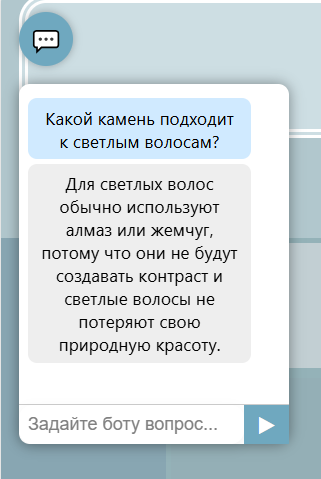

## Прототип онлайн-магазина ювелирных изделий.
Фронтенд, бэкенд, микросервисы (основной функционал магазина и авторизация). 
1) Фронтенд (React) находится в разделе front
2) Микросервис авторизации (Java, Spring, JWT, данные в Redis) - в security, 
3) Микросервис взаимодействия с товарами (Java, Spring, данные в PostgreSQL) - в разделе store.

----
Интеграция нейросетей: реализована возможность общаться с локально развернутой LLM, которая выполняет роль консультанта.

